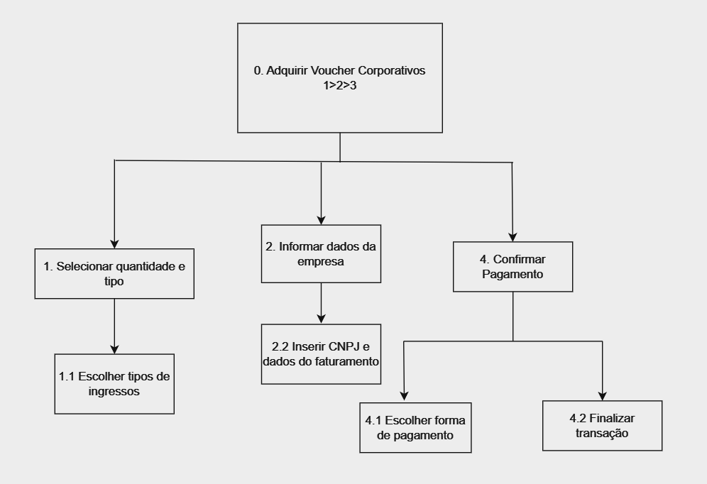

### **Introdução**  
A análise de tarefas é um método essencial para compreender o trabalho dos usuários, como eles realizam suas ações e os motivos por trás delas. Nesse contexto, o trabalho é definido em termos dos objetivos que os usuários desejam ou precisam alcançar.

Esse tipo de análise pode ser usado para avaliar a situação atual, para o redesenho ou para a avaliação de intervenções, como a introdução de um novo sistema. Uma das etapas fundamentais nessa análise é coletar e identificar os objetivos que os usuários pretendem atingir com o sistema em questão.

No caso do Cinemark, o site possue como foco central a experiência do cliente em relação à compra de ingressos e ao acesso à programação dos cinemas. Outras funcionalidades incluem a compra de alimentos, consulta ao histórico de compras, gerenciamento de reservas, informações sobre promoções e fidelidade.

As tarefas principais selecionadas para análise foram:

- **Comprar ingressos para filmes em cartaz**
- **Consultar a programação de filmes e sessões disponíveis**
- **Comprar alimentos e bebidas com retirada no cinema**
- **Gerenciar reservas e histórico de compras**

Essas tarefas foram definidas seguindo os dados do perfil dos usuários, que apontam maior uso dessas funções no site e aplicativo do Cinemark.

### **Metodologia**
Para analisar as tarefas realizadas pelos usuários do Cinemark, utilizamos duas técnicas, a Análise Hierárquica de Tarefas (HTA), que foi aplicada para tarefas complexas e sequenciais, e Árvore de Tarefas Concorrentes (CTT), utilizada em tarefas com escolhas ou interações simultâneas. Cada uma foi selecionada com base nas características das tarefas e no nível de interação necessário.

### **Análise Hierárquica de Tarefas**
**Análise HTA 1: Comprar ingressos**

A compra de ingressos é uma das principais tarefas realizadas pelos usuários do Cinemark. Esta tarefa envolve múltiplas etapas, como seleção do filme, escolha da sessão, dos assentos e finalização do pagamento. Análise detalhada:

| Objetivos/Operações |    Relações    |                 Problemas e Recomendações         |  
| :----: | :----------------: | :-----------------------------------------------: | 
|  0. Comprar ingressos  | 1 > 2 > 3 > 4 | Input: acessar o site ou app, selecionar filme e sessão, escolher assentos e finalizar pagamento | 
| Plano: seguir a sequência de passos |  |   Problema: interface pode confundir usuários com baixa experiência digital |
| 1. Selecionar filme e sessão | 1 > 2 |   Plano: escolher o filme, em seguida selecionar o horário e data da sessão |
| 2. Escolher assentos | | Plano: clicar no mapa interativo e selecionar as cadeiras desejadas |
| 3. Adicionar serviços extras | | Plano: incluir alimentos ou upgrade para sala premium | 
| 4. Finalizar pagamento | | Plano: inserir dados do cartão de crédito, Pix ou cupom de desconto | 
| Feedback: receber confirmação de compra |||

**Análise HTA 2: Comprar alimentos e bebidas**

A funcionalidade de compra antecipada de alimentos permite maior conveniência ao usuário, especialmente em horários de pico. Análise:

| Objetivos/Operações |    Relações    |                 Problemas e Recomendações         |  
| :----: | :----------------: | :-----------------------------------------------: | 
| 0. Comprar alimentos e bebidas | 1 > 2 > 3  | Input: acessar o menu, selecionar itens e realizar o pagamento | 
| Plano: seguir a sequência de passos |  |  Problema: falta de clareza nos tamanhos das porções (ex.: pipoca) |
| 1. Acessar o menu de alimentos |  |   Plano: abrir o menu dentro do aplicativo ou site |
| 2. Selecionar os itens desejados | | Plano: adicionar os itens ao carrinho e verificar preços totais |
| 3. Realizar o pagamento| | Plano: incluir alimentos ou upgrade para sala premium | 
| 4. Finalizar pagamento | | Plano: escolher método de pagamento e confirmar a retirada no cinema escolhido | 

**Análise de Tarefas HTA 3: Reserva de Salas**

O Cinemark disponibiliza a funcionalidade de reserva de salas para eventos particulares, como reuniões corporativas, festas de aniversário ou exibições exclusivas de filmes. O processo é realizado de forma online por meio do site ou aplicativo.

| Objetivos/Operações |    Relações    |                 Problemas e Recomendações         |  
| :----: | :----------------: | :-----------------------------------------------: | 
| 0. Reservar uma sala de cinema | 1 > 2 > 3 > 4 > 5 | Problema: Usuários podem enfrentar dificuldades para escolher horários disponíveis | 
| 1. Selecionar local |  | Plano: Escolher o cinema desejado |
| 1.1. Escolher cidade|  |    |
| 1.2. Selecionar unidade | |  |
| 2. Escolher data e horário| 1 > 2 | Plano: Informar data e horário para ver disponibilidade  | 
| 3. Selecionar tipo de evento | | Plano: Informar o tipo de evento (corporativo, festa de aniversário, exibição privada) | 
| 4. Preencher dados pessoais | | 	Plano: Inserir informações de contato e detalhes adicionais do evento | 
| 5. Confirmar e efetuar reserva | | 	Plano: Realizar pagamento ou solicitar orçamento | 

**Análise de Tarefas HTA 4: Cinemark Club**

O Cinemark Club é o programa de assinatura que oferece descontos em ingressos e outros benefícios exclusivos para os membros. A tarefa analisada aborda o processo de adesão ao clube.

| Objetivos/Operações |    Relações    |                 Problemas e Recomendações         |  
| :----: | :----------------: | :-----------------------------------------------: | 
| 0. Inscrever-se no Cinemark Club | 1 > 2 > 3 > 4 | 	Problema: Informações pouco claras sobre os benefícios | 
| 1. Acessar página de inscrição |  | Plano: Entrar no site/app e navegar até a página do Cinemark Club |
| 2. Selecionar plano |  |  Plano: Escolher entre os planos disponíveis (mensal ou anual) |
| 3. Preencher dados pessoais | | Plano: Informar nome, CPF, e-mail e dados de pagamento  |
| 4. Confirmar adesão | | 	Plano: Aceitar os termos e confirmar o pagamento  | 

**Análise de Tarefas HTA 5: Voucher Corporativo**

O Voucher Corporativo é uma funcionalidade voltada para empresas que desejam adquirir ingressos em grande quantidade para colaboradores ou parceiros.

| Objetivos/Operações |    Relações    |                 Problemas e Recomendações         |  
| :----: | :----------------: | :-----------------------------------------------: | 
| 0. Adquirir vouchers corporativos | 1 > 2 > 3 | 	Problema: Falta de transparência no processo de entrega dos vouchers  | 
| 1. Selecionar quantidade e tipo de voucher |  | Plano: Escolher entre vouchers de ingressos normais ou premium |
| 2. Informar dados da empresa |  |  Plano: Preencher informações da empresa, como CNPJ e endereço de faturamento |
| 3. Confirmar pagamento | |Plano: Escolher forma de pagamento e concluir a transação  |

### **Árvore de Tarefas Concorrentes (CTT) - Cinemark**
**Motivo da Escolha**

A Árvore de Tarefas Concorrentes (CTT) foi escolhida para analisar as interações de usuários no sistema Cinemark, pois ela permite representar de forma clara as tarefas concorrentes e sequenciais que ocorrem durante o processo de compra de ingressos, reserva de salas e gestão de benefícios como o Cinemark Club e o voucher corporativo. Esta técnica ajuda a identificar tarefas que podem ser realizadas ao mesmo tempo e a entender as dependências entre elas.

**Análise da Tarefa CTT 1: Reserva de Salas**

A tarefa "Reserva de Salas" envolve várias interações do usuário com o sistema, onde o usuário escolhe o filme, o horário, a sala e a quantidade de ingressos. Além disso, pode incluir uma etapa de pagamento ou escolha de benefícios como ingressos promocionais ou vouchers.

Fluxo da Tarefa:

- **O usuário acessa o site do Cinemark.**
- **O usuário escolhe o filme desejado.**
- **O usuário escolhe a data e o horário da sessão.**
- **O sistema apresenta as salas disponíveis.**
- **O usuário seleciona a sala de sua preferência.**
- **O usuário escolhe a quantidade de ingressos.**
- **O sistema processa o pagamento ou reserva de ingressos.**
- **O usuário recebe a confirmação da reserva.**

**Análise da Tarefa CTT 2: Cinemark Club**

O Cinemark Club permite que os usuários acumulem pontos para trocar por ingressos ou benefícios exclusivos. O processo para gerenciar o Cinemark Club inclui fazer login, verificar os pontos acumulados, resgatar prêmios, e eventualmente, renovar a associação.

Fluxo da Tarefa:

- **O usuário acessa sua conta no Cinemark Club.**
- **O usuário consulta a quantidade de pontos acumulados.**
- **O usuário escolhe um prêmio ou benefício para resgatar.**
- **O usuário aplica o resgate de pontos na compra de ingressos ou produtos.**
- **O sistema atualiza os pontos após o resgate.**
- **O usuário recebe um comprovante de resgate.**

**Análise da Tarefa CTT 3: Voucher Corporativo**

Os vouchers corporativos oferecem aos funcionários benefícios como ingressos ou descontos para sessões de cinema. O processo de resgatar um voucher corporativo pode ser feito através do site, sendo necessário um código de acesso fornecido pela empresa.

Fluxo da Tarefa:

- **O usuário acessa a página de resgate de vouchers corporativos.**
- **O usuário insere o código do voucher.**
- **O sistema valida o código.**
- **O sistema exibe os ingressos disponíveis para resgatar.**
- **O usuário escolhe os ingressos desejados e confirma o resgate.**
- **O sistema processa o resgate e envia a confirmação por e-mail ou mensagem.**

## Bibliografia

Barbosa S. D. J., Silva B. S. da. Interação Humano-Computador. Elsevier, 2010. 
    
## Histórico de versões

| Versão |     Descrição      |                     Autor(es)                     |    Data    |                     Revisor(es)                     | Data de revisão |
| :----: | :----------------: | :-----------------------------------------------: | :--------: | :-------------------------------------------------: | :-------------: |
|  1.0   | Criação da página | [Ana Joyce](https://github.com/anajoyceamorim) | 01/12/2024 | [Anne de Capdeville](https://github.com/nanecapde) |   01/12/2024   |
|  2.0   | Conteúdo da página | [Anne de Capdeville](https://github.com/nanecapde) | 02/12/2024 | [Ana Joyce](https://github.com/anajoyceamorim) |  03/12/2024  |
