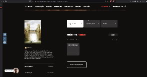

## Introdução 

O projeto deve estar fundamento em princípios, diretrizes e padrões que orientam o design e a avaliação do sistema. Os princípios são objetivos gerais de alto nível, enquanto diretrizes representam regras práticas e padrões, soluções específicas para contextos delimitados. Mesmo com essa diferença entre os termos geralmente utilizamos as duas formas em conjunto. Teorias notáveis incluem os princípios de Norman (1988), as heurísticas de Nielsen (1994) e as regras deoutro de Shneiderman (1988), amplamente reconhecidos na área de Interação Humano-Computador. 

Os Princípios desempenham um papel auxiliar no design, mas não substituem as etapas essencias de análise, concepção e avaliação. Sua aplicação eficaz exige uma compreensão aprofundada do problema, dos usuários e de suas atividades. Norman (1988) destaca a importância de um modelo conceitual claro, que permita ao usuário compreender facilmente o sistema e suas interações. Também cita a correspondência com expectativas, simplicidade, consistência, promoção de eficiência e design para prevenir e lidar com erros.

## Metodologia

A fim de embasar a definição dos princípios e diretrizes aplicáveis ao site Cinemark, utilizamos principalmente o capítulo 10 do livro Interação Humano-Computador e Experiência do Usuário (Barbosa, 2021). Tal seção aborda diretamente a explicação e aplicação das diretrizes essenciais permitindo avaliar a conformidade do site com as boas práticas de usabilidade, a identificação de erros e propostas de melhoria.

## 1. Correspondência com as Expectativas dos Usuários  
**Definição:** Segundo Norman, a interface deve alinhar-se ao modelo mental do usuário, garantindo que as ações no sistema reflitam a forma como as tarefas são realizadas no mundo real, explorando mapeamentos naturais e mantendo consistência com as expectativas habituais do usuário.  
**Análise:** O site Cinemark atende parcialmente ao princípio ao organizar os filmes em cartaz de forma intuitiva e apresentar horários de sessões de forma clara. No entanto, o fluxo de login obrigatório antes de escolher os filmes pode frustrar usuários que desejam explorar o site antes de se identificarem.  
**Sugestão:** Permitir navegação anônima até a etapa final de compra, mantendo a identificação como opcional até o momento do pagamento, para respeitar o modelo mental típico de compra.

{: width="300"}

---

## 2. Simplicidade nas Estruturas das Tarefas  
**Definição:** Simplificar as estruturas das tarefas significa reduzir a complexidade desnecessária e fornecer suporte para que o usuário realize as tarefas com o menor esforço possível.  
**Análise:** O Cinemark apresenta uma estrutura linear para compra de ingressos, o que facilita o processo. No entanto, explorar categorias específicas de filmes ou promoções exige vários cliques, o que pode tornar a experiência menos intuitiva.  
**Sugestão:** Agrupar informações relacionadas, como categorias de filmes e promoções, em menus mais acessíveis na página inicial, reduzindo a necessidade de navegação profunda.

---

## 3. Equilíbrio entre Controle e Liberdade do Usuário  
**Definição:** O equilíbrio entre controle e liberdade permite que o usuário explore diferentes caminhos para realizar uma tarefa, mantendo o controle sem sobrecarga de opções desnecessárias.  
**Análise:** O site oferece liberdade ao usuário na escolha de poltronas, mas limita o controle em outras áreas, como a ausência de filtros avançados para horários e tipos de sala, dificultando a busca personalizada.  
**Sugestão:** Implementar filtros para tipos de sala (3D, IMAX), horários e idiomas, permitindo que o usuário personalize a busca por sessões de acordo com suas preferências.

---

## 4. Consistência e Padronização  
**Definição:** Interfaces consistentes e padronizadas facilitam o aprendizado e o uso contínuo ao garantir que elementos semelhantes funcionem de maneira uniforme, reduzindo a carga cognitiva do usuário.  
**Análise:** O site mantém consistência visual e funcional em elementos como botões e ícones, mas a terminologia varia, com rótulos como "Promoções" e "Ofertas" criando confusão desnecessária.  
**Sugestão:** Uniformizar a nomenclatura em todo o site, utilizando termos consistentes para categorias semelhantes, como unificar "Promoções" e "Ofertas" sob um único título.

---

## 5. Promoção da Eficiência do Usuário  
**Definição:** Priorizar a eficiência do usuário envolve otimizar o tempo e os passos necessários para realizar uma tarefa, promovendo atalhos e respostas rápidas do sistema.  
**Análise:** O fluxo de compra é eficiente e linear, mas o tempo de carregamento de páginas pode ser prolongado, especialmente em dispositivos móveis, prejudicando a experiência.  
**Sugestão:** Implementar otimizações para carregamento mais rápido, sem abrir outras telas, como compactação de recursos e uma versão mobile mais leve, melhorando a eficiência em dispositivos móveis.

---

## 6. Antecipação das Necessidades do Usuário  
**Definição:** Interfaces devem prever as necessidades dos usuários, oferecendo informações e ferramentas relevantes antes que sejam solicitadas, aumentando a fluidez da interação.  
**Análise:** O site exibe filmes populares, mas não personaliza recomendações com base no histórico de navegação ou compras do usuário, perdendo a oportunidade de antecipar preferências.  
**Sugestão:** Adotar um sistema de recomendação que sugira filmes e sessões com base no comportamento anterior do usuário, personalizando a experiência.

---

## 7. Visibilidade e Reconhecimento  
**Definição:** Visibilidade garante que os usuários percebam claramente o estado do sistema e as opções disponíveis, enquanto reconhecimento minimiza a necessidade de memorização.  
**Análise:** O Cinemark fornece feedback visual em ações como a escolha de poltronas, mas mensagens de erro durante o pagamento não são detalhadas, dificultando a correção.  
**Sugestão:** Aprimorar as mensagens de erro, oferecendo feedback claro e orientado à solução, como destacar problemas específicos no formulário de pagamento.

{: width="300"}

---

## 8. Conteúdo Relevante e Expressão Adequada  
**Definição:** Conteúdo claro e relevante reduz a carga cognitiva e melhora a experiência, utilizando informações concisas e livres de ambiguidade.  
**Análise:** O site apresenta informações objetivas sobre filmes e horários, mas detalhes de promoções e eventos podem ser difíceis de localizar, impactando sua visibilidade.  
**Sugestão:** Criar uma seção dedicada e destacada para promoções e eventos no menu principal, aumentando sua relevância e acessibilidade.

---

## 9. Projeto para Erros  
**Definição:** Sistemas devem prever erros do usuário, oferecendo recuperação fácil e evitando que ações críticas sejam realizadas inadvertidamente.  
**Análise:** O site permite corrigir a seleção de poltronas sem reiniciar o processo, mas mensagens de erro, como as relacionadas ao login ou pagamento, são genéricas e pouco úteis.  
**Sugestão:** Elaborar mensagens de erro informativas e construtivas, sugerindo ações corretivas claras e evitando linguagem técnica ou confusa.

## Referências

BARBOSA, Simone Diniz Junqueira et al. Interação humano-computador e experiência do usuário [livro eletrônico]. 1. ed. Rio de Janeiro: Simone Diniz Junqueira Barbosa, 2021. Disponível em: formato PDF.

## Histórico de versões

| Versão |     Descrição      |                     Autor(es)                     |    Data    |                     Revisor(es)                     | Data de revisão |
| :----: | :----------------: | :-----------------------------------------------: | :--------: | :-------------------------------------------------: | :-------------: |
|  1.0   | Criação da página | [Ana Joyce](https://github.com/anajoyceamorim) | 02/12/2024 | [Anne de Capdeville](https://github.com/nanecapde) |   02/12/2024   |
|  1.1  | Adição da estrutura do documento | [Pedro Miguel](https://github.com/pedroMADBR) | 05/12/2024 | [nome](https://github.com/user) |   xx/12/2024   |
|  1.2   | Construção dos princípios | [Pedro Miguel](https://github.com/pedroMADBR) | 10/12/2024 | [Nome](https://github.com/Nome) |   xx/12/2024   |
